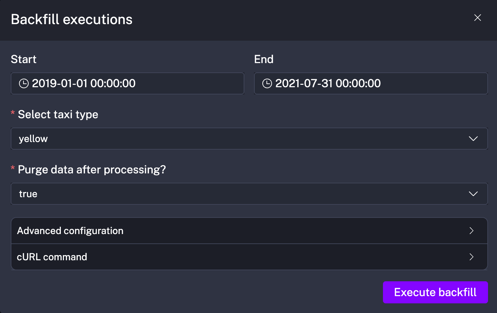
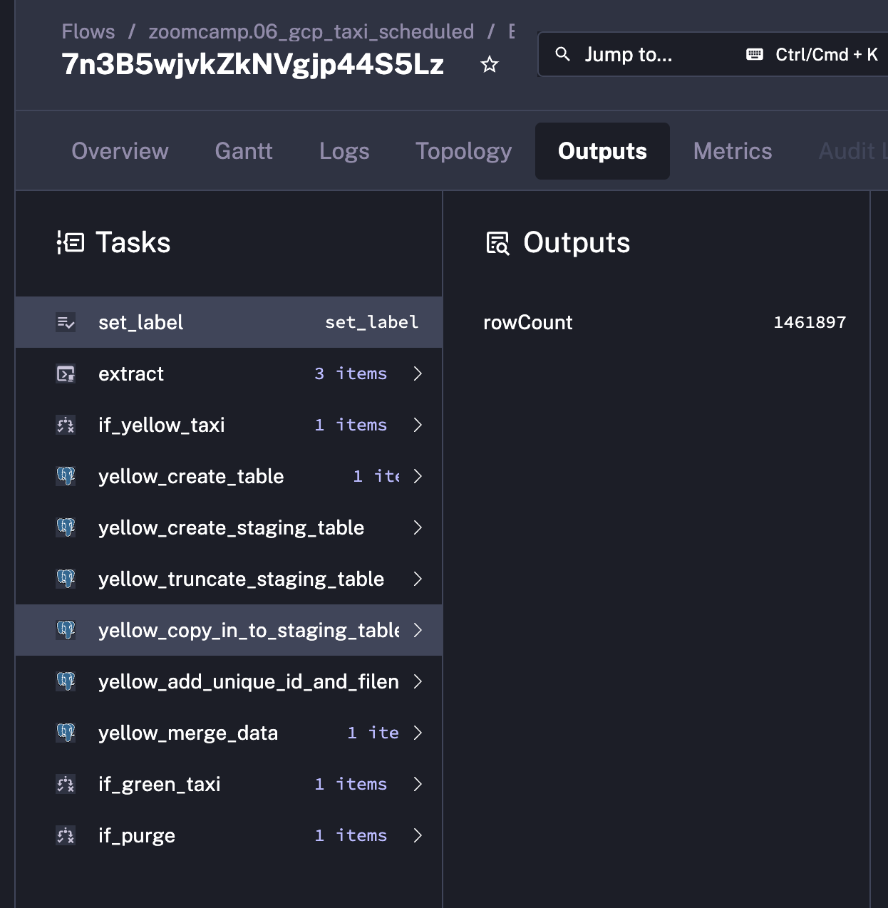

# Module 2: Workflow Orchestration

In this homework the following subjects are covered: workflow orchestration, Kestra and ETL pipelines

### Prerequisites:

#### Start instances of Kestra and Postgres

It is necessary to start the instance of **postgres** where data is going to be injested to and instance of **Kestra** for data orchestration.

See: [docker-compose.yml](docker-compose.yml)

```sh
docker-compose up
```

#### Configure Kestra Flow

- Open Kestra Dashboard by using the link: http://localhost:8080;
- Go to Flows tab;
- And Click on "+ Create" button to create a new Flow;
- Now copy and paste flow from [kestra_taxi_data_flow.yaml](kestra_taxi_data_flow.yaml).

#### Backfill data into Postgres

We have to injest and feed consumed taxi data from _2019-01-01_ until _2021-07-01_.

- Navigate to "Triggers" tab of the flow created above;
- Click on "Backfill executions" button under **yellow_schedule**
- Now enter required date interval and click "Execute"
- Do the same for **green** taxi trips



---

### Questions {and answers}

#### Question 1.

Within the execution for Yellow Taxi data for the year 2020 and month 12: what is the uncompressed file size (i.e. the output file yellow_tripdata_2020-12.csv of the extract task)?

> **Answer**: 128.3 MB (from Kestra Flow outputs with input variable `purge` set to `false`)

#### Question 2.

What is the rendered value of the variable file when the inputs taxi is set to green, year is set to 2020, and month is set to 04 during execution?

> **Answer**: green*tripdata_2020-04.csv (format is `file: "{{inputs.taxi}}\_tripdata*{{trigger.date | date('yyyy-MM')}}.csv"`)

#### Question 3.

How many rows are there for the Yellow Taxi data for all CSV files in the year 2020?

> **Answer**: 24,648,499 (from Kestra Flow `rowCount` outputs of the step `yellow_copy_in_to_staging_table`, that are summed up)



#### Question 4.

How many rows are there for the Green Taxi data for all CSV files in the year 2020?

> **Answer**: 1,734,051 (from Kestra Flow `rowCount` outputs of the step `green_copy_in_to_staging_table`, that are summed up)

#### Question 5.

How many rows are there for the Yellow Taxi data for the March 2021 CSV file?

> **Answer**: 1,925,152 (from Kestra Flow `rowCount` outputs of the step `yellow_copy_in_to_staging_table` for execution `2021-03`)

#### Question 6.

How would you configure the timezone to New York in a Schedule trigger?

> **Answer**: Add a timezone property set to America/New_York in the Schedule trigger configuration ([Link to docs](https://arc.net/l/quote/ubowljvy))
